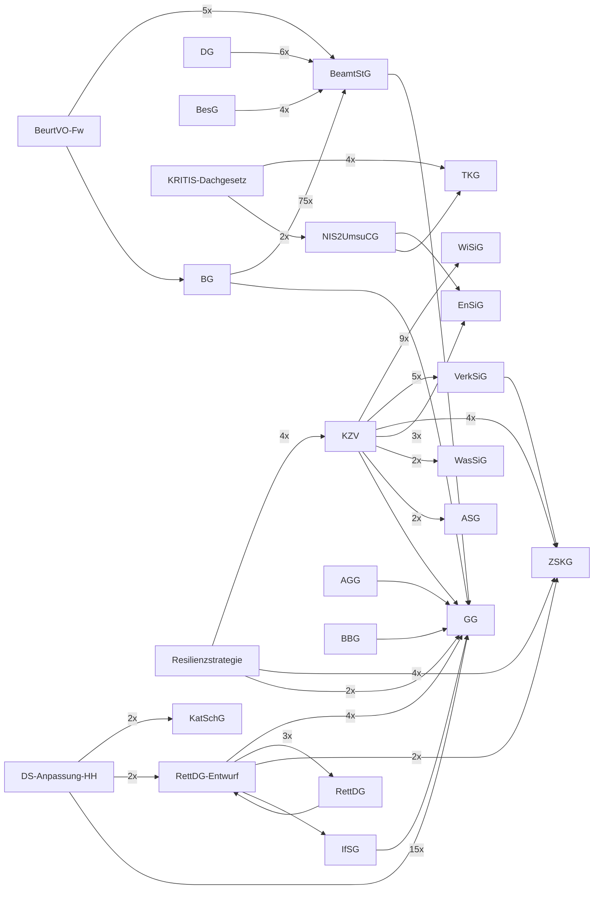

# Rechtssammlung

Kuratierte Sammlung deutscher Rechtstexte als Markdown. Schwerpunkte: Zivile Verteidigung, Kritische Infrastrukturen, Katastrophenschutz Hamburg, Beamtenrecht.

Konvertiert aus PDF mit [lldr](https://github.com/tobiaswildezahn/law-loader) (`pip install git+https://github.com/tobiaswildezahn/law-loader.git`).

## Inhalt

### Grundgesetz

| Datei | Dokument |
|-------|----------|
| `grundgesetz/GG.md` | Grundgesetz fuer die Bundesrepublik Deutschland |

### Zivile Verteidigung

| Datei | Dokument |
|-------|----------|
| `zivile-verteidigung/KZV.md` | Konzeption Zivile Verteidigung (2016) |
| `zivile-verteidigung/resilienz-katastrophen.md` | Deutsche Strategie zur Staerkung der Resilienz gegenueber Katastrophen (BMI 2022) |
| `zivile-verteidigung/ZSKG_Zivilschutzgesetz.md` | Zivilschutz- und Katastrophenhilfegesetz |

#### Sicherstellungsgesetze

| Datei | Dokument |
|-------|----------|
| `sicherstellungsgesetze/ASG_*.md` | Arbeitssicherstellungsgesetz |
| `sicherstellungsgesetze/EnSiG_*.md` | Energiesicherungsgesetz |
| `sicherstellungsgesetze/ESVG_*.md` | Ernaehrungssicherstellungsgesetz |
| `sicherstellungsgesetze/VerkSiG_*.md` | Verkehrssicherstellungsgesetz |
| `sicherstellungsgesetze/WasSiG_*.md` | Wassersicherstellungsgesetz |
| `sicherstellungsgesetze/WiSiG_*.md` | Wirtschaftssicherstellungsgesetz |
| `sicherstellungsgesetze/PostG_*.md` | Postgesetz (inkl. Sicherstellung) |
| `sicherstellungsgesetze/TKG_*.md` | Telekommunikationsgesetz |

### Kritische Infrastrukturen

| Datei | Dokument |
|-------|----------|
| `kritis/KRITIS-Dachgesetz_BT-Drucksache.md` | KRITIS-Dachgesetz (BT-Drucksache) |
| `kritis/NIS2UmsuCG_Bundesgesetzblatt.md` | NIS-2-Umsetzungsgesetz (BGBl.) |

### Gesundheit

| Datei | Dokument |
|-------|----------|
| `gesundheit/IfSG_Infektionsschutzgesetz.md` | Infektionsschutzgesetz |

### Hamburg

#### Katastrophenschutz

| Datei | Dokument |
|-------|----------|
| `hamburg/katastrophenschutz/KatSchG_HA.md` | Hamburgisches Katastrophenschutzgesetz |
| `hamburg/katastrophenschutz/KatSO_Hamburg.md` | Katastrophenschutzordnung Hamburg |
| `hamburg/katastrophenschutz/FeuerwG_HA.md` | Feuerwehrgesetz Hamburg |
| `hamburg/katastrophenschutz/RettDG_HA_2019.md` | Rettungsdienstgesetz Hamburg |

#### Beamtenrecht

| Datei | Dokument |
|-------|----------|
| `hamburg/beamtenrecht/BG_HA_2009.md` | Beamtengesetz Hamburg |
| `hamburg/beamtenrecht/BeamtVG_HA.md` | Beamtenversorgungsgesetz Hamburg |
| `hamburg/beamtenrecht/BesG_HA_2010.md` | Besoldungsgesetz Hamburg |
| `hamburg/beamtenrecht/DG_HA.md` | Disziplinargesetz Hamburg |
| `hamburg/beamtenrecht/GleichstG_HA_2015.md` | Gleichstellungsgesetz Hamburg |
| `hamburg/beamtenrecht/PersVG_HA_2014.md` | Personalvertretungsgesetz Hamburg |

#### Sonstige Hamburg

| Datei | Dokument |
|-------|----------|
| `hamburg/SOG_HA.md` | Gesetz zum Schutz der oeffentlichen Sicherheit und Ordnung |
| `hamburg/BeurtVO-Fw.md` | Beurteilungsverordnung Feuerwehr Hamburg |
| `hamburg/datenschutz-anpassung/*.md` | Datenschutzanpassung KatSG/FwG/RDG |

### Beamtenrecht Bund

| Datei | Dokument |
|-------|----------|
| `beamtenrecht-bund/BBG.md` | Bundesbeamtengesetz |
| `beamtenrecht-bund/BeamtStG.md` | Beamtenstatusgesetz |
| `beamtenrecht-bund/AGG.md` | Allgemeines Gleichbehandlungsgesetz |
| `beamtenrecht-bund/ArbZG.md` | Arbeitszeitgesetz |
| `beamtenrecht-bund/BUrlG.md` | Bundesurlaubsgesetz |

### Parlamentaria

| Datei | Dokument |
|-------|----------|
| `parlamentaria/21_16376_entwurf_rettungsdienstgesetz.md` | Entwurf Rettungsdienstgesetz Hamburg (Bue-Drs. 21/16376) |

## Querverweise

Automatisch erkannte Referenzen zwischen Dokumenten (`lldr crossref`). Maschinenlesbar in `index.json`.



## Neue Dokumente hinzufuegen

```bash
# PDF konvertieren
lldr convert dokument.pdf -o /tmp/out

# In passenden Ordner verschieben
cp /tmp/out/dokument.md <kategorie>/

# Committen
git add . && git commit -m "Add: <Dokumentname>"
git push
```

## Konventionen

- Dateinamen: `<Abkuerzung>_<Langname>.md` oder `<Abkuerzung>.md`
- Hamburger Gesetze: Suffix `_HA` oder `_Hamburg`
- Ordnerstruktur thematisch, nicht alphabetisch
- Dieses Repo ist die Single Source of Truth fuer alle konvertierten Rechtstexte
