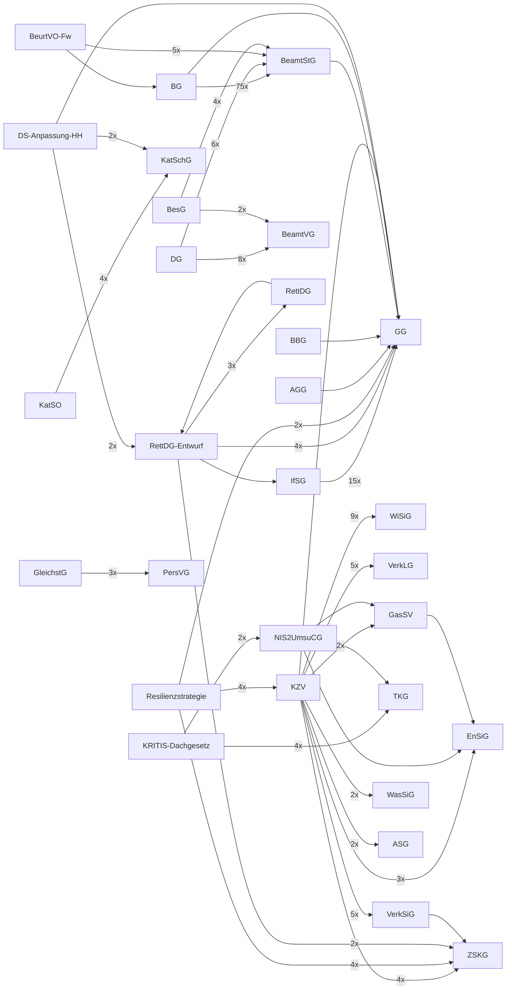

# Rechtssammlung

Kuratierte Sammlung deutscher Rechtstexte als Markdown. Schwerpunkte: Zivile Verteidigung, Kritische Infrastrukturen, Katastrophenschutz Hamburg, Beamtenrecht.

Konvertiert aus PDF mit [lldr](https://github.com/tobiaswildezahn/law-loader) (`pip install git+https://github.com/tobiaswildezahn/law-loader.git`).

## Inhalt

### Grundgesetz

| Datei | Dokument |
|-------|----------|
| `grundgesetz/GG.md` | Grundgesetz für die Bundesrepublik Deutschland |

### Zivile Verteidigung

| Datei | Dokument |
|-------|----------|
| `zivile-verteidigung/KZV.md` | Konzeption Zivile Verteidigung |
| `zivile-verteidigung/ZSKG_Zivilschutzgesetz.md` | Zivilschutzgesetz |
| `zivile-verteidigung/resilienz-katastrophen.md` | Deutsche Strategie zur Stärkung der Resilienz gegenüber Katastrophen |

#### Sicherstellungsgesetze

| Datei | Dokument |
|-------|----------|
| `zivile-verteidigung/sicherstellungsgesetze/ASG_Arbeitssicherstellungsgesetz.md` | Arbeitssicherstellungsgesetz |
| `zivile-verteidigung/sicherstellungsgesetze/ESVG_Ernaehrungssicherstellungsgesetz.md` | Ernaehrungssicherstellungsgesetz |
| `zivile-verteidigung/sicherstellungsgesetze/EltSV_Elektrizitaetssicherungsverordnung.md` | Elektrizitaetssicherungsverordnung |
| `zivile-verteidigung/sicherstellungsgesetze/EnSiG_Energiesicherungsgesetz.md` | Energiesicherungsgesetz |
| `zivile-verteidigung/sicherstellungsgesetze/GasSV_Gassicherungsverordnung.md` | Gassicherungsverordnung |
| `zivile-verteidigung/sicherstellungsgesetze/PostG_Postgesetz_inkl_Sicherstellung.md` | Postgesetz inkl Sicherstellung |
| `zivile-verteidigung/sicherstellungsgesetze/TKG_Telekommunikationsgesetz.md` | Telekommunikationsgesetz |
| `zivile-verteidigung/sicherstellungsgesetze/VerkLG_Verkehrsleistungsgesetz.md` | Verkehrsleistungsgesetz |
| `zivile-verteidigung/sicherstellungsgesetze/VerkSiG_Verkehrssicherstellungsgesetz.md` | Verkehrssicherstellungsgesetz |
| `zivile-verteidigung/sicherstellungsgesetze/WasSiG_Wassersicherstellungsgesetz.md` | Wassersicherstellungsgesetz |
| `zivile-verteidigung/sicherstellungsgesetze/WiSiG_Wirtschaftssicherstellungsgesetz.md` | Wirtschaftssicherstellungsgesetz |

### Kritische Infrastrukturen

| Datei | Dokument |
|-------|----------|
| `kritis/KRITIS-Dachgesetz_BT-Drucksache.md` | Entwurf eines Gesetzes zur Umsetzung der Richtlinie (EU) 2022/2557 und zur Stärkung der Resilienz kritischer Anlagen |
| `kritis/NIS2UmsuCG_Bundesgesetzblatt.md` | NIS-2-Umsetzungsgesetz |

### Gesundheit

| Datei | Dokument |
|-------|----------|
| `gesundheit/IfSG_Infektionsschutzgesetz.md` | Infektionsschutzgesetz |

#### Katastrophenschutz

| Datei | Dokument |
|-------|----------|
| `hamburg/katastrophenschutz/FeuerwG_HA.md` | Feuerwehrgesetz Hamburg |
| `hamburg/katastrophenschutz/KatSO_Hamburg.md` | Katastrophenschutzordnung Hamburg |
| `hamburg/katastrophenschutz/KatSchG_HA.md` | Hamburgisches Katastrophenschutzgesetz |
| `hamburg/katastrophenschutz/RettDG_HA_2019.md` | Hamburgisches Rettungsdienstgesetz |

#### Beamtenrecht

| Datei | Dokument |
|-------|----------|
| `hamburg/beamtenrecht/BG_HA_2009.md` | Hamburgisches Beamtengesetz |
| `hamburg/beamtenrecht/BeamtVG_HA.md` | Hamburgisches Beamtenversorgungsgesetz |
| `hamburg/beamtenrecht/BesG_HA_2010.md` | Hamburgisches Besoldungsgesetz |
| `hamburg/beamtenrecht/DG_HA.md` | Hamburgisches Disziplinargesetz |
| `hamburg/beamtenrecht/GleichstG_HA_2015.md` | Hamburgisches Gleichstellungsgesetz |
| `hamburg/beamtenrecht/PersVG_HA_2014.md` | Hamburgisches Personalvertretungsgesetz |

#### Sonstige Hamburg

| Datei | Dokument |
|-------|----------|
| `hamburg/BeurtVO-Fw.md` | Beurteilungsverordnung Feuerwehr |
| `hamburg/SOG_HA.md` | Gesetz zum Schutz der öffentlichen Sicherheit und Ordnung |
| `hamburg/datenschutz-anpassung/21_12396_datenschutz_anpassung_katsg_fwg_rdg.md` | 12396 datenschutz anpassung katsg fwg rdg |

### Beamtenrecht Bund

| Datei | Dokument |
|-------|----------|
| `beamtenrecht-bund/AGG.md` | Allgemeines Gleichbehandlungsgesetz |
| `beamtenrecht-bund/ArbZG.md` | Arbeitszeitgesetz |
| `beamtenrecht-bund/BBG.md` | Bundesbeamtengesetz |
| `beamtenrecht-bund/BUrlG.md` | Mindesturlaubsgesetz für Arbeitnehmer |
| `beamtenrecht-bund/BeamtStG.md` | Gesetz zur Regelung des Statusrechts der Beamtinnen und Beamten in den Ländern |

### Parlamentaria

| Datei | Dokument |
|-------|----------|
| `parlamentaria/21_16376_entwurf_rettungsdienstgesetz.md` | 16376 entwurf rettungsdienstgesetz |

## Querverweise

Automatisch erkannte Referenzen zwischen Dokumenten (`lldr crossref`). Maschinenlesbar in `index.json`.



## Neue Dokumente hinzufuegen

```bash
# PDF konvertieren
lldr convert dokument.pdf -o /tmp/out

# In passenden Ordner verschieben
cp /tmp/out/dokument.md <kategorie>/

# Committen (post-commit Hook aktualisiert index.json, Querverweise und README automatisch)
git add . && git commit -m "Add: <Dokumentname>"
git push
```

## Konventionen

- Dateinamen: `<Abkuerzung>_<Langname>.md` oder `<Abkuerzung>.md`
- Hamburger Gesetze: Suffix `_HA` oder `_Hamburg`
- Ordnerstruktur thematisch, nicht alphabetisch
- Dieses Repo ist die Single Source of Truth fuer alle konvertierten Rechtstexte
